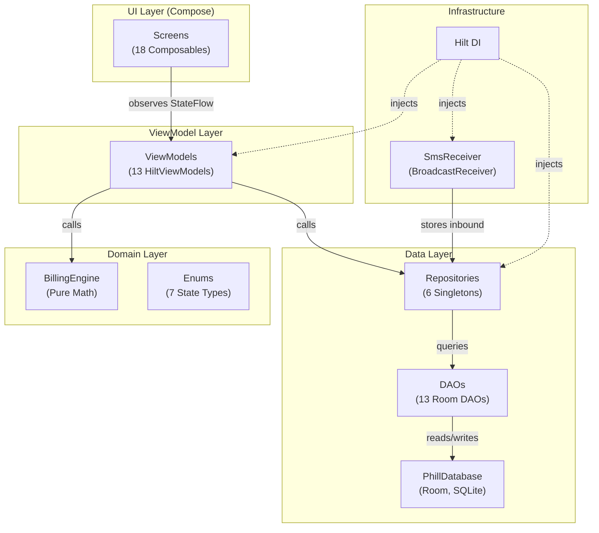
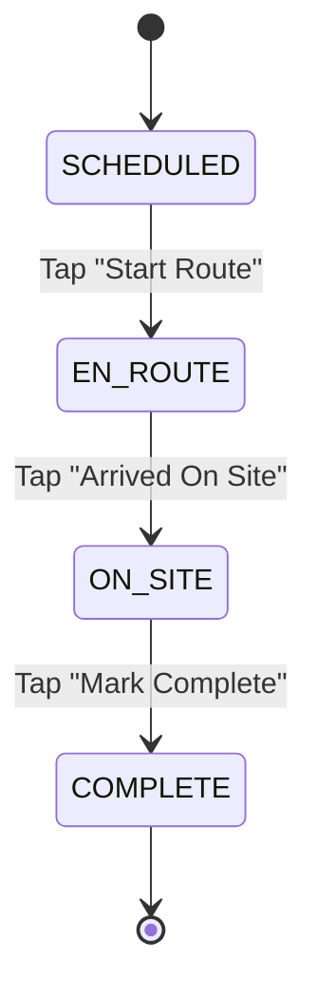
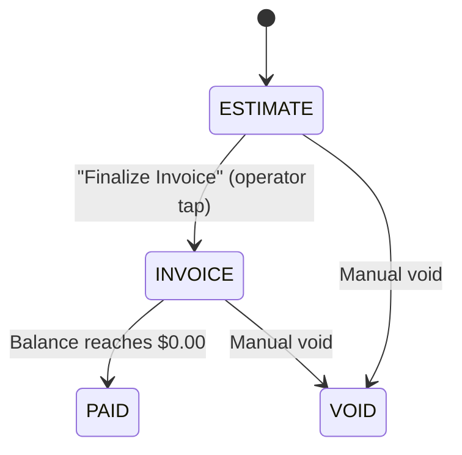
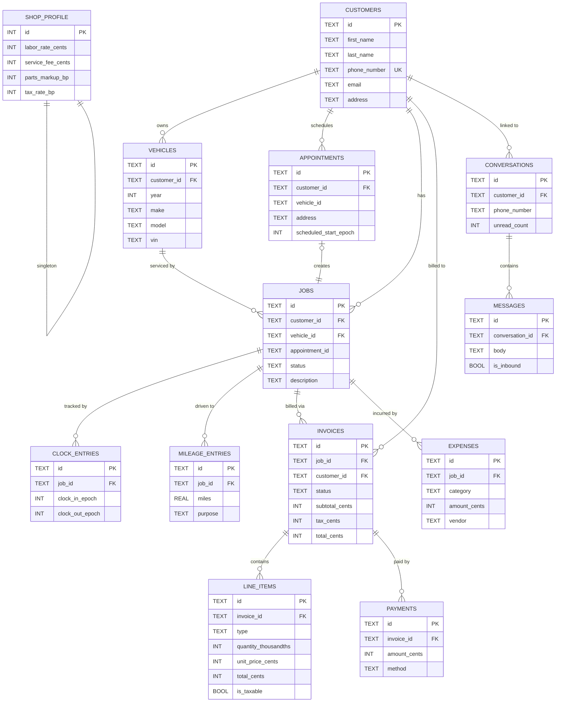
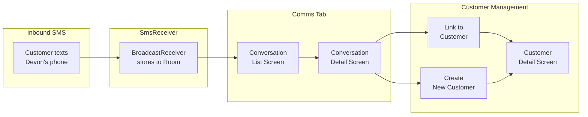
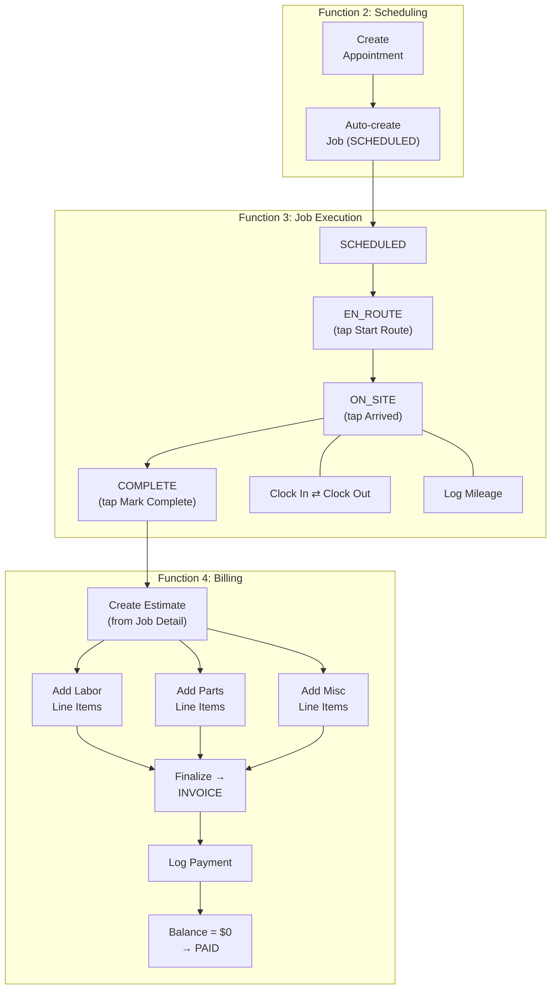
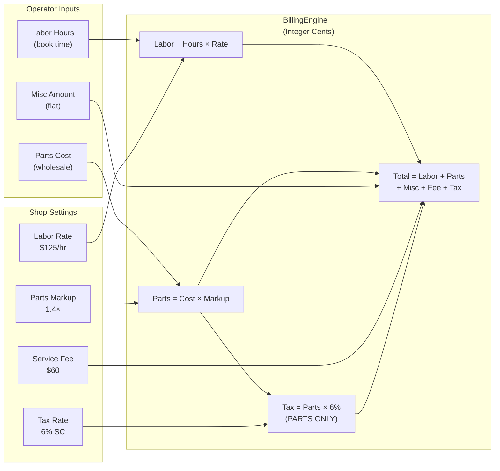
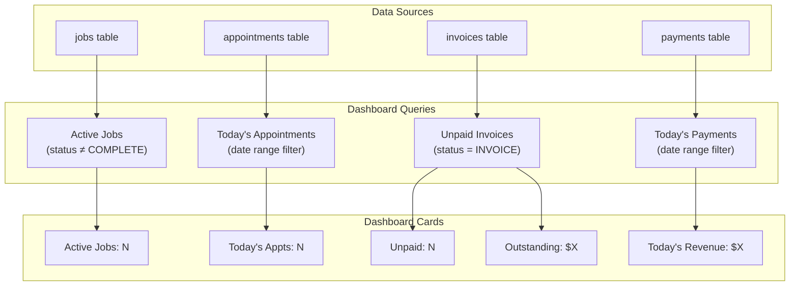
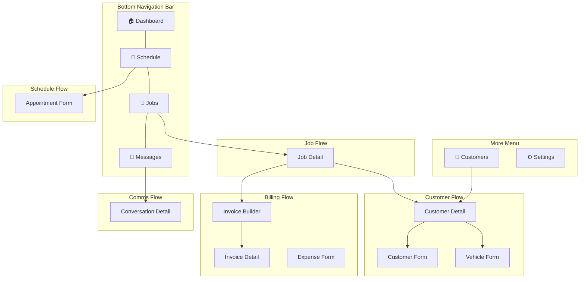

# Project Phil — Technical Documentation & Operator's Manual
## Phillips Mobile Automotive — Shop Management Platform
### Version 1.0 — May 25, 2026

---

## Table of Contents

1. [Architecture Overview](#1-architecture-overview)
2. [Technology Stack](#2-technology-stack)
3. [Data Schema — All 13 Entities](#3-data-schema--all-13-entities)
4. [Enum Types — All State Machines](#4-enum-types--all-state-machines)
5. [Entity Relationship Diagram](#5-entity-relationship-diagram)
6. [Data Flow Diagrams](#6-data-flow-diagrams)
7. [BillingEngine — Financial Math Specification](#7-billingengine--financial-math-specification)
8. [Navigation Map](#8-navigation-map)
9. [Repository Layer — API Surface](#9-repository-layer--api-surface)
10. [Safety Rules — HITL Gatekeeping](#10-safety-rules--hitl-gatekeeping)
11. [Operator's Manual](#11-operators-manual)

---

## 1. Architecture Overview

Phil follows a strict **MVVM + Repository** pattern with unidirectional data flow:



### Key Principles

| Principle | Implementation |
|---|---|
| **Customer-Centric** | Customer is the root entity. Every screen traces back to a customer record. |
| **Data-Focused** | Every field has both a write path (form) and read path (list/detail). No dead tables. |
| **Relation-Minded** | Foreign keys connect the full context chain. One tap surfaces the relational web. |
| **Manual-First** | Every action requires explicit operator input. No automation in v1. |
| **Offline-First** | All data stored locally in Room. No network dependency. |

---

## 2. Technology Stack

| Layer | Technology | Version |
|---|---|---|
| Language | Kotlin | 2.1.20 |
| UI Framework | Jetpack Compose + Material 3 | BOM 2025.05 |
| Navigation | `androidx.navigation3` | Alpha |
| Database | Room (SQLite) | 2.7.1 |
| DI | Hilt (Dagger) | 2.56.2 |
| Build | Gradle (Kotlin DSL) | 9.1.0 |
| Serialization | kotlinx.serialization | 1.8.1 |
| Min SDK | 26 (Android 8.0) | |
| Target SDK | 35 | |
| Target Device | Samsung Galaxy A16 | 4GB RAM |
| JVM Heap Limit | 1536MB | Memory-constrained |

---

## 3. Data Schema — All 13 Entities

### 3.1 `customers` — Root Entity

> [!IMPORTANT]
> The customer is the **root node** of the entire data model. Everything traces back here.

| Column | Type | Constraints | Description |
|---|---|---|---|
| `id` | `TEXT` | PK, UUID | Unique identifier |
| `first_name` | `TEXT` | NOT NULL | Customer first name |
| `last_name` | `TEXT` | NOT NULL | Customer last name |
| `phone_number` | `TEXT` | NOT NULL, UNIQUE | Primary phone (unique index) |
| `email` | `TEXT` | nullable | Email address |
| `address` | `TEXT` | nullable | Service address |
| `notes` | `TEXT` | nullable | Operator notes |
| `created_at_epoch` | `INTEGER` | NOT NULL | Creation timestamp (ms) |
| `updated_at_epoch` | `INTEGER` | NOT NULL | Last update timestamp (ms) |

**Indices:** `phone_number` (unique)

---

### 3.2 `vehicles` — Customer's Vehicle Fleet

| Column | Type | Constraints | Description |
|---|---|---|---|
| `id` | `TEXT` | PK, UUID | Unique identifier |
| `customer_id` | `TEXT` | FK → customers.id, CASCADE | Owner reference |
| `year` | `INTEGER` | nullable | Model year |
| `make` | `TEXT` | NOT NULL | Manufacturer |
| `model` | `TEXT` | NOT NULL | Model name |
| `engine` | `TEXT` | nullable | Engine spec |
| `vin` | `TEXT` | nullable | Vehicle Identification Number |
| `color` | `TEXT` | nullable | Exterior color |
| `notes` | `TEXT` | nullable | Operator notes |
| `created_at_epoch` | `INTEGER` | NOT NULL | Creation timestamp |

**FK:** `customer_id` → `customers.id` (ON DELETE CASCADE)
**Indices:** `customer_id`

---

### 3.3 `appointments` — Scheduling

| Column | Type | Constraints | Description |
|---|---|---|---|
| `id` | `TEXT` | PK, UUID | Unique identifier |
| `customer_id` | `TEXT` | FK → customers.id, CASCADE | Customer reference |
| `vehicle_id` | `TEXT` | nullable | Vehicle reference |
| `job_id` | `TEXT` | nullable | Auto-created job link |
| `address` | `TEXT` | NOT NULL | Service location |
| `scheduled_start_epoch` | `INTEGER` | NOT NULL | Start time (ms) |
| `scheduled_end_epoch` | `INTEGER` | nullable | End time (ms) |
| `notes` | `TEXT` | nullable | Appointment notes |
| `status` | `TEXT` | NOT NULL, default PENDING | AppointmentStatus enum |
| `created_at_epoch` | `INTEGER` | NOT NULL | Creation timestamp |

**FK:** `customer_id` → `customers.id` (ON DELETE CASCADE)
**Indices:** `customer_id`, `scheduled_start_epoch`

> [!NOTE]
> A 15-minute buffer is automatically added to the beginning and end of each appointment for setup/cleanup. This is enforced in the UI layer (ScheduleViewModel), not in the entity.

---

### 3.4 `jobs` — Work Execution

| Column | Type | Constraints | Description |
|---|---|---|---|
| `id` | `TEXT` | PK, UUID | Unique identifier |
| `customer_id` | `TEXT` | FK → customers.id, CASCADE | Customer reference |
| `vehicle_id` | `TEXT` | FK → vehicles.id, CASCADE | Vehicle being serviced |
| `appointment_id` | `TEXT` | nullable | Source appointment |
| `status` | `TEXT` | NOT NULL, default SCHEDULED | JobStatus enum |
| `description` | `TEXT` | nullable | Job description |
| `notes` | `TEXT` | nullable | Operator notes |
| `created_at_epoch` | `INTEGER` | NOT NULL | Creation timestamp |
| `completed_at_epoch` | `INTEGER` | nullable | Completion timestamp |

**FKs:** `customer_id` → `customers.id`, `vehicle_id` → `vehicles.id` (both CASCADE)
**Indices:** `customer_id`, `vehicle_id`, `status`

---

### 3.5 `clock_entries` — Internal Time Tracking

| Column | Type | Constraints | Description |
|---|---|---|---|
| `id` | `TEXT` | PK, UUID | Unique identifier |
| `job_id` | `TEXT` | FK → jobs.id, CASCADE | Parent job |
| `clock_in_epoch` | `INTEGER` | NOT NULL | Clock-in time (ms) |
| `clock_out_epoch` | `INTEGER` | nullable | Clock-out time (ms, null = active) |
| `notes` | `TEXT` | nullable | Session notes |

**FK:** `job_id` → `jobs.id` (ON DELETE CASCADE)

> [!IMPORTANT]
> Clock entries are **completely decoupled from billing**. They exist for Devon's internal efficiency tracking only. Billing uses flat-rate book hours.

---

### 3.6 `mileage_entries` — Trip Tracking

| Column | Type | Constraints | Description |
|---|---|---|---|
| `id` | `TEXT` | PK, UUID | Unique identifier |
| `job_id` | `TEXT` | FK → jobs.id, SET NULL | Optional job link |
| `miles` | `REAL` | NOT NULL | Miles driven |
| `purpose` | `TEXT` | nullable | Trip purpose |
| `recorded_at_epoch` | `INTEGER` | NOT NULL | Recording timestamp |

**FK:** `job_id` → `jobs.id` (ON DELETE SET NULL)

---

### 3.7 `invoices` — Financial Documents

| Column | Type | Constraints | Description |
|---|---|---|---|
| `id` | `TEXT` | PK, UUID | Unique identifier |
| `job_id` | `TEXT` | FK → jobs.id, CASCADE | Parent job |
| `customer_id` | `TEXT` | FK → customers.id, CASCADE | Billing customer |
| `status` | `TEXT` | NOT NULL, default ESTIMATE | InvoiceStatus enum |
| `subtotal_cents` | `INTEGER` | NOT NULL, default 0 | Subtotal in cents |
| `tax_cents` | `INTEGER` | NOT NULL, default 0 | Tax in cents |
| `total_cents` | `INTEGER` | NOT NULL, default 0 | Grand total in cents |
| `service_fee_cents` | `INTEGER` | NOT NULL, default 0 | Service fee in cents |
| `created_at_epoch` | `INTEGER` | NOT NULL | Creation timestamp |
| `finalized_at_epoch` | `INTEGER` | nullable | When status changed to INVOICE |

**FKs:** `job_id` → `jobs.id`, `customer_id` → `customers.id` (both CASCADE)
**Indices:** `job_id`, `customer_id`, `status`

> [!CAUTION]
> **Legal Compliance:** All invoices MUST be preceded by an estimate/work order. The system enforces this: `finalizeAsInvoice()` only operates on documents with `ESTIMATE` status.

---

### 3.8 `line_items` — Invoice Line Items

| Column | Type | Constraints | Description |
|---|---|---|---|
| `id` | `TEXT` | PK, UUID | Unique identifier |
| `invoice_id` | `TEXT` | FK → invoices.id, CASCADE | Parent invoice |
| `type` | `TEXT` | NOT NULL | LineItemType enum |
| `description` | `TEXT` | NOT NULL | Line item description |
| `quantity_thousandths` | `INTEGER` | NOT NULL, default 1000 | Quantity × 1000 (e.g., 1.5 hrs = 1500) |
| `unit_price_cents` | `INTEGER` | NOT NULL | Unit price in cents |
| `total_cents` | `INTEGER` | NOT NULL, default 0 | Line total in cents |
| `is_taxable` | `INTEGER` | NOT NULL, default 0 | 1 = taxable (parts only) |
| `sort_order` | `INTEGER` | NOT NULL, default 0 | Display order |

**FK:** `invoice_id` → `invoices.id` (ON DELETE CASCADE)

---

### 3.9 `payments` — Payment Records

| Column | Type | Constraints | Description |
|---|---|---|---|
| `id` | `TEXT` | PK, UUID | Unique identifier |
| `invoice_id` | `TEXT` | FK → invoices.id, CASCADE | Invoice being paid |
| `amount_cents` | `INTEGER` | NOT NULL | Payment amount in cents |
| `method` | `TEXT` | NOT NULL | PaymentMethod enum |
| `reference_number` | `TEXT` | nullable | Check #, transaction ID, etc. |
| `paid_at_epoch` | `INTEGER` | NOT NULL | Payment timestamp |
| `notes` | `TEXT` | nullable | Payment notes |

**FK:** `invoice_id` → `invoices.id` (ON DELETE CASCADE)

---

### 3.10 `expenses` — Business Expenses

| Column | Type | Constraints | Description |
|---|---|---|---|
| `id` | `TEXT` | PK, UUID | Unique identifier |
| `job_id` | `TEXT` | FK → jobs.id, SET NULL | Optional job link |
| `category` | `TEXT` | NOT NULL | ExpenseCategory enum |
| `description` | `TEXT` | NOT NULL | Expense description |
| `amount_cents` | `INTEGER` | NOT NULL | Amount in cents |
| `vendor` | `TEXT` | nullable | Vendor name |
| `date_epoch` | `INTEGER` | NOT NULL | Expense date |
| `notes` | `TEXT` | nullable | Notes |

**FK:** `job_id` → `jobs.id` (ON DELETE SET NULL)
**Indices:** `job_id`, `date_epoch`

---

### 3.11 `conversations` — SMS Threads

| Column | Type | Constraints | Description |
|---|---|---|---|
| `id` | `TEXT` | PK, UUID | Unique identifier |
| `customer_id` | `TEXT` | FK → customers.id, SET NULL | Linked customer |
| `phone_number` | `TEXT` | NOT NULL | Thread phone number |
| `display_name` | `TEXT` | nullable | Contact display name |
| `last_message_epoch` | `INTEGER` | nullable | Last message timestamp |
| `unread_count` | `INTEGER` | NOT NULL, default 0 | Unread message count |

**FK:** `customer_id` → `customers.id` (ON DELETE SET NULL)
**Indices:** `customer_id`, `phone_number`

---

### 3.12 `messages` — Individual SMS Messages

| Column | Type | Constraints | Description |
|---|---|---|---|
| `id` | `TEXT` | PK, UUID | Unique identifier |
| `conversation_id` | `TEXT` | FK → conversations.id, CASCADE | Parent thread |
| `body` | `TEXT` | NOT NULL | Message text |
| `timestamp_epoch` | `INTEGER` | NOT NULL | Message timestamp |
| `is_inbound` | `INTEGER` | NOT NULL | 1 = received, 0 = sent |
| `status` | `TEXT` | NOT NULL, default RECEIVED | MessageStatus enum |

**FK:** `conversation_id` → `conversations.id` (ON DELETE CASCADE)
**Indices:** `conversation_id`, `timestamp_epoch`

---

### 3.13 `shop_profile` — Business Configuration (Singleton)

| Column | Type | Default | Description |
|---|---|---|---|
| `id` | `INTEGER` | PK = 1 | Always 1 (singleton) |
| `business_name` | `TEXT` | null | Business name for documents |
| `business_address` | `TEXT` | null | Business base address |
| `labor_rate_cents` | `INTEGER` | 12500 | $125.00/hr |
| `service_fee_cents` | `INTEGER` | 6000 | $60.00 per job |
| `parts_markup_basis_points` | `INTEGER` | 14000 | 1.4× (140%) |
| `tax_rate_basis_points` | `INTEGER` | 600 | 6.0% SC sales tax |
| `tax_id` | `TEXT` | null | EIN / Tax ID |
| `license_number` | `TEXT` | null | Business license |
| `owner_name` | `TEXT` | null | Owner name |
| `owner_phone` | `TEXT` | null | Owner phone |

> [!IMPORTANT]
> **Zero hardcoded values.** All pricing variables come from this table. Defaults are sensible starting values that the operator edits in Shop Settings.

---

## 4. Enum Types — All State Machines

### 4.1 JobStatus — Job Lifecycle



| Value | Meaning |
|---|---|
| `SCHEDULED` | Job created, waiting for day-of execution |
| `EN_ROUTE` | Operator is driving to the customer |
| `ON_SITE` | Operator is physically at the job location |
| `COMPLETE` | Work finished |

---

### 4.2 InvoiceStatus — Financial Document Lifecycle



| Value | Meaning |
|---|---|
| `ESTIMATE` | Draft work order / estimate (editable) |
| `INVOICE` | Finalized billing document |
| `PAID` | All payments received, balance = $0 |
| `VOID` | Cancelled document |

---

### 4.3 AppointmentStatus

| Value | Meaning |
|---|---|
| `PENDING` | Awaiting confirmation |
| `CONFIRMED` | Customer confirmed |
| `CANCELLED` | Appointment cancelled |

### 4.4 LineItemType

| Value | Meaning | Tax Rule |
|---|---|---|
| `LABOR` | Book hours × labor rate | NOT taxed |
| `PARTS` | Part cost × markup | TAXED (SC §117-306) |
| `MISC` | Flat amount (supplies, disposal) | NOT taxed |

### 4.5 PaymentMethod

| Value | Description |
|---|---|
| `CASH` | Cash payment |
| `CHECK` | Paper check |
| `CARD` | Credit/debit card |
| `DIGITAL` | Venmo, Zelle, CashApp, etc. |

### 4.6 ExpenseCategory

| Value | Description |
|---|---|
| `PARTS` | Parts purchased for jobs |
| `FUEL` | Gas/diesel for service vehicle |
| `SUPPLIES` | Shop supplies, consumables |
| `TOOLS` | Tool purchases |
| `OTHER` | Uncategorized |

### 4.7 MessageStatus

| Value | Description |
|---|---|
| `SENT` | Outbound message sent |
| `DELIVERED` | Delivery confirmed |
| `FAILED` | Send failed |
| `RECEIVED` | Inbound message received |

---

## 5. Entity Relationship Diagram



---

## 6. Data Flow Diagrams

### 6.1 Customer Intake Flow (Function 1 → Function 2)



---

### 6.2 Appointment → Job → Invoice Flow (Functions 2 → 3 → 4)



---

### 6.3 Financial Calculation Flow (BillingEngine)



---

### 6.4 Dashboard Aggregation Flow (Function 5)



---

## 7. BillingEngine — Financial Math Specification

> [!CAUTION]
> **The Fiduciary Rule:** All monetary values are stored as `Long` (64-bit integer cents). No floating-point currency math, ever. This eliminates rounding errors in tax and margin calculations.

### Core Methods

| Method | Input | Output | Formula |
|---|---|---|---|
| `calculateLineItemTotal` | qty (thousandths), price (cents) | cents | `qty × price / 1000` |
| `calculateTax` | subtotal (cents), rate (basis points) | cents | `subtotal × rate / 10000` |
| `applyPartsMarkup` | cost (cents), markup (basis points) | cents | `cost × markup / 10000` |
| `calculateInvoiceTotal` | line items, fee, tax rate | InvoiceTotals | Sum all + tax on parts only |

### Unit Conversions

| Method | Input | Output | Example |
|---|---|---|---|
| `formatCents` | `12500L` | `"$125.00"` | Display |
| `parseDollarsToCents` | `"125.00"` | `12500L` | Storage |
| `formatBasisPoints` | `600` | `"6.00%"` | Display |
| `parsePercentToBasisPoints` | `"6.0"` | `600` | Storage |
| `formatThousandths` | `1500L` | `"1.5"` | Display |
| `parseHoursToThousandths` | `"1.5"` | `1500L` | Storage |

### Worked Example

```
Job: Replace alternator on 2018 Toyota Camry

Labor:   1.8 book hours × $125.00/hr = $225.00
Parts:   $145.00 cost × 1.4 markup   = $203.00
Misc:    Shop supplies                = $12.50
Service: Onsite fee                   = $60.00
Tax:     $203.00 × 6% (parts only)    = $12.18

TOTAL = $225.00 + $203.00 + $12.50 + $60.00 + $12.18 = $512.68
```

In integer cents:
```
Labor:   1800 × 12500 / 1000 = 22500
Parts:   14500 × 14000 / 10000 = 20300
Misc:    1250 (direct)
Service: 6000 (from ShopProfile)
Tax:     20300 × 600 / 10000 = 1218

TOTAL = 22500 + 20300 + 1250 + 6000 + 1218 = 51268 → $512.68
```

---

## 8. Navigation Map



### All 18 Navigation Keys

| Key | Type | Parameters | Target Screen |
|---|---|---|---|
| `DashboardKey` | object | — | DashboardScreen |
| `ScheduleKey` | object | — | ScheduleScreen |
| `JobQueueKey` | object | — | JobQueueScreen |
| `CommsKey` | object | — | ConversationListScreen |
| `CustomerListKey` | object | — | CustomerListScreen |
| `BillingKey` | object | — | (Hub placeholder) |
| `AnalyticsKey` | object | — | (Hub placeholder) |
| `ShopSettingsKey` | object | — | ShopSettingsScreen |
| `CustomerDetailKey` | data class | `customerId: String` | CustomerDetailScreen |
| `CustomerFormKey` | data class | `customerId: String?` | CustomerFormScreen |
| `VehicleFormKey` | data class | `customerId, vehicleId?` | VehicleFormScreen |
| `AppointmentFormKey` | data class | `appointmentId: String?` | AppointmentFormScreen |
| `JobDetailKey` | data class | `jobId: String` | JobDetailScreen |
| `InvoiceBuilderKey` | data class | `jobId, invoiceId?` | InvoiceBuilderScreen |
| `InvoiceDetailKey` | data class | `invoiceId: String` | InvoiceDetailScreen |
| `ConversationKey` | data class | `conversationId: String` | ConversationDetailScreen |
| `ExpenseFormKey` | data class | `jobId?, expenseId?` | ExpenseFormScreen |
| `PaymentLogKey` | object | — | (Hub placeholder) |

---

## 9. Repository Layer — API Surface

### 9.1 CustomerRepository

| Method | Return | Description |
|---|---|---|
| `observeAllCustomers()` | `Flow<List<Customer>>` | Reactive list of all customers |
| `searchCustomers(query)` | `Flow<List<Customer>>` | Full-text search by name/phone |
| `getCustomerById(id)` | `Customer?` | Single lookup |
| `getCustomerByPhone(phone)` | `Customer?` | Lookup by phone (unique) |
| `saveCustomer(entity)` | — | Insert or update |
| `deleteCustomer(entity)` | — | Delete |
| `observeVehicles(customerId)` | `Flow<List<Vehicle>>` | Vehicles for a customer |
| `getVehicleById(id)` | `Vehicle?` | Single lookup |
| `saveVehicle(entity)` | — | Insert or update |
| `deleteVehicle(entity)` | — | Delete |

### 9.2 ScheduleRepository

| Method | Return | Description |
|---|---|---|
| `observeByDateRange(start, end)` | `Flow<List<Appointment>>` | Appointments in time range |
| `getAppointmentById(id)` | `Appointment?` | Single lookup |
| `saveAppointment(entity)` | — | Insert or update |
| `deleteAppointment(entity)` | — | Delete |

### 9.3 JobRepository

| Method | Return | Description |
|---|---|---|
| `observeAllJobs()` | `Flow<List<Job>>` | All jobs |
| `observeJobsByCustomer(id)` | `Flow<List<Job>>` | Jobs for a customer |
| `observeJobsByStatus(status)` | `Flow<List<Job>>` | Jobs filtered by status |
| `getJobById(id)` | `Job?` | Single lookup |
| `saveJob(entity)` | — | Insert or update |
| `observeClockEntries(jobId)` | `Flow<List<ClockEntry>>` | Clock entries for job |
| `getActiveClockEntry(jobId)` | `ClockEntry?` | Currently active clock |
| `saveClockEntry(entity)` | — | Insert or update |
| `observeMileage(jobId)` | `Flow<List<Mileage>>` | Mileage for job |
| `saveMileage(entity)` | — | Insert or update |

### 9.4 BillingRepository

| Method | Return | Description |
|---|---|---|
| `observeAllInvoices()` | `Flow<List<Invoice>>` | All invoices |
| `observeInvoicesByJob(id)` | `Flow<List<Invoice>>` | Invoices for a job |
| `observeInvoicesByCustomer(id)` | `Flow<List<Invoice>>` | Invoices for a customer |
| `observeInvoicesByStatus(status)` | `Flow<List<Invoice>>` | By status filter |
| `getInvoiceById(id)` | `Invoice?` | Single lookup |
| `saveInvoice(entity)` | — | Insert or update |
| `observeLineItems(invoiceId)` | `Flow<List<LineItem>>` | Line items for invoice |
| `saveAllLineItems(list)` | — | Batch insert |
| `deleteLineItemsByInvoice(id)` | — | Clear line items |
| `observePaymentsByInvoice(id)` | `Flow<List<Payment>>` | Payments for invoice |
| `observeAllPayments()` | `Flow<List<Payment>>` | All payments |
| `totalPaidForInvoice(id)` | `Long` | Sum of payment cents |
| `savePayment(entity)` | — | Insert or update |

### 9.5 CommsRepository

| Method | Return | Description |
|---|---|---|
| `observeAllConversations()` | `Flow<List<Conversation>>` | All SMS threads |
| `getConversationById(id)` | `Conversation?` | Single lookup |
| `getConversationByPhone(phone)` | `Conversation?` | Lookup by phone |
| `saveConversation(entity)` | — | Insert or update |
| `getOrCreateConversation(phone)` | `Conversation` | Find or create thread |
| `observeMessages(conversationId)` | `Flow<List<Message>>` | Messages in thread |
| `saveMessage(entity)` | — | Insert or update |

### 9.6 OperationsRepository

| Method | Return | Description |
|---|---|---|
| `observeShopProfile()` | `Flow<ShopProfile?>` | Reactive shop settings |
| `getShopProfile()` | `ShopProfile?` | Current settings |
| `saveShopProfile(entity)` | — | Insert or update |
| `observeAllExpenses()` | `Flow<List<Expense>>` | All expenses |
| `observeExpensesByJob(id)` | `Flow<List<Expense>>` | Expenses for a job |
| `getExpenseById(id)` | `Expense?` | Single lookup |
| `totalExpensesInRange(start, end)` | `Long` | Sum cents in date range |
| `saveExpense(entity)` | — | Insert or update |
| `observeAllMileage()` | `Flow<List<Mileage>>` | All mileage entries |
| `totalMilesInRange(start, end)` | `Double` | Sum miles in date range |
| `saveMileage(entity)` | — | Insert or update |

---

## 10. Safety Rules — HITL Gatekeeping

> [!CAUTION]
> These 6 rules are **non-negotiable law**. Any code that violates them is rejected.

| # | Rule | Enforcement |
|---|---|---|
| 1 | **No autonomous customer communication** | SmsReceiver stores only. Send requires explicit tap of Send button. |
| 2 | **No autonomous data commitment** | All forms require explicit Save/Confirm tap. No auto-save. |
| 3 | **No autonomous financial actions** | Invoices, payments, and ledger entries require manual creation. `finalizeAsInvoice()` requires tap. |
| 4 | **All Phil-populated fields must be editable** | Service fee, labor rate, legal clause — all editable before finalization. |
| 5 | **Complete manual input path always exists** | Every field is manually typed. No auto-fill-only fields. |
| 6 | **Phil-populated data visually distinguishable** | Pre-filled fields (e.g., address from customer) are clearly pre-populated but editable. |

---

## 11. Operator's Manual

### 11.1 First Launch — Shop Settings

1. Open Phil → tap the **⚙️ gear icon** (More menu → Settings)
2. Enter your business details:
   - **Business Name:** Phillips Mobile Automotive
   - **Business Address:** Your base location
   - **Owner Name / Phone**
   - **Tax ID / License Number**
3. Configure pricing:
   - **Labor Rate:** Your $/hr (default: $125.00)
   - **Service Fee:** Per-job travel fee (default: $60.00)
   - **Parts Markup:** Multiplier on parts cost (default: 1.4×)
   - **Tax Rate:** State sales tax on parts (default: 6.0%)
4. Tap **Save Settings** → confirmation snackbar appears

---

### 11.2 Adding a Customer

1. Bottom bar → **More** → **Customers** → tap **+** (FAB)
2. Enter:
   - **First Name** / **Last Name** (required)
   - **Phone Number** (required, must be unique)
   - **Email**, **Address**, **Notes** (optional)
3. Tap **Save** → navigates to Customer Detail

---

### 11.3 Adding a Vehicle

1. From **Customer Detail** → tap **"Add Vehicle"**
2. Enter:
   - **Make** / **Model** (required)
   - **Year**, **Engine**, **VIN**, **Color**, **Notes** (optional)
3. Tap **Save** → returns to Customer Detail

---

### 11.4 Scheduling an Appointment

1. Bottom bar → **📅 Schedule** → tap **+** (FAB)
2. **Search and select a customer** (type to search)
3. Select a **vehicle** from the customer's fleet
4. Set **date** and **time** (Material 3 pickers)
5. Verify the **address** (pre-filled from customer, editable)
6. Add optional **notes**
7. Tap **Save** → appointment appears on calendar

> [!NOTE]
> A **15-minute buffer** is automatically added before and after each appointment for setup/cleanup. The buffer is displayed on schedule cards but does not modify the stored times.

**Schedule Views:**
- **Day:** Single day with time slots
- **Week:** 7-day horizontal view
- **Month:** Calendar grid
- Use **◀ ▶ arrows** to navigate between periods
- Tap **"Today"** to return to current date

---

### 11.5 Working a Job

When an appointment is saved, a **Job** is automatically created in `SCHEDULED` status.

**Day-of workflow:**

1. Bottom bar → **🔧 Jobs** → see your job queue
2. Tap a job to open **Job Detail**
3. **Status progression** (tap the big colored button):

| Step | Button Text | What Happens |
|---|---|---|
| 1 | **Start Route** | Status → EN_ROUTE (blue) |
| 2 | **Arrived On Site** | Status → ON_SITE (orange) |
| 3 | **Mark Complete** | Status → COMPLETE (green) |

4. **Clock In/Out** (while on site):
   - Tap **Clock In** → live timer starts (orange, ticking every second)
   - Work on the vehicle
   - Tap **Clock Out** → entry logged with duration
   - Multiple clock entries per job are supported (breaks, interruptions)

5. **Log Mileage:**
   - Tap **"Log Mileage"**
   - Enter **miles driven** and optional **purpose**
   - Tap **Save**

---

### 11.6 Creating an Estimate → Invoice

> [!WARNING]
> **Legal requirement:** All invoices MUST be preceded by an estimate/work order. The app enforces this.

1. From **Job Detail** → tap **"Create Estimate"**
2. **Invoice Builder** opens showing customer and vehicle info
3. **Add line items:**
   - Tap **"+ Labor"** → enter description, book hours, rate (pre-filled from settings)
   - Tap **"+ Parts"** → enter description, qty, cost (markup auto-applied)
   - Tap **"+ Misc"** → enter description, qty, amount
4. **Service fee** is pre-filled from Shop Settings (editable)
5. **Totals** auto-calculate in real-time:
   - Labor Subtotal
   - Parts Subtotal (with markup)
   - Misc Subtotal
   - Service Fee
   - Tax (6% on parts ONLY)
   - **GRAND TOTAL**
6. **Terms & Conditions** — editable legal clause
7. Two actions:
   - **Save Estimate** — saves as draft (can edit later)
   - **Finalize Invoice** — converts to billing document (available only when status = ESTIMATE)

---

### 11.7 Logging Payments

1. From **Job Detail** → tap on an existing invoice
2. **Invoice Detail** screen shows:
   - Total amount
   - Amount paid
   - Remaining balance
   - Payment history
3. Tap **"Log Payment"**
4. Enter:
   - **Amount** (pre-filled with remaining balance)
   - **Method:** Cash / Check / Card / Digital
   - **Reference #** (optional — check number, transaction ID)
   - **Notes** (optional)
5. Tap **Save**
6. When remaining balance reaches **$0.00**, invoice auto-changes to **PAID** status

---

### 11.8 Tracking Expenses

1. From **Job Detail** or via nav → **Expense Form**
2. Enter:
   - **Amount** (required)
   - **Description** (required — e.g., "Alternator from AutoZone")
   - **Vendor** (optional — e.g., "AutoZone")
   - **Category:** Parts / Fuel / Supplies / Tools / Other
   - **Notes** (optional)
3. Tap **Save** (FAB)

---

### 11.9 Messaging Customers (SMS)

1. Bottom bar → **💬 Messages**
2. See all conversation threads, sorted by most recent
3. **Unread badges** show count of new messages
4. Tap a conversation → **chat view** opens
5. Messages display as **chat bubbles:**
   - **Grey (left)** = inbound from customer
   - **Blue (right)** = your outbound messages
6. Type in the compose bar at the bottom
7. Tap **Send** (arrow icon) to send

> [!CAUTION]
> **Phil NEVER sends a message autonomously.** Every outbound SMS requires you to type it and tap Send. If you receive a message while under a car, it sits in the inbox until you're ready.

**Inbound messages are captured automatically** by the SmsReceiver and stored in the database. They appear in real-time when you open the Comms tab.

---

### 11.10 Dashboard — Daily Overview

1. Bottom bar → **🏠 Dashboard** (home screen)
2. At a glance:

| Card | What It Shows |
|---|---|
| **Active Jobs** | Count of jobs not yet COMPLETE |
| **Today's Revenue** | Sum of payments received today |
| **Today's Appts** | Appointments scheduled for today |
| **Unpaid Invoices** | Count of invoices in INVOICE status |
| **Outstanding Balance** | ⚠️ Yellow alert with total dollars owed |
| **Today's Jobs** | List of active jobs with descriptions and status |

---

### 11.11 Customer Detail — The Relational Hub

The Customer Detail screen is the **single pane of glass** for any customer relationship:

| Section | What You See |
|---|---|
| **Header** | Name, phone, email, address |
| **Vehicles** | All vehicles owned (tap to edit) |
| **Jobs** | Count of associated jobs |
| **Balance** | Outstanding invoice balance |
| **Quick Actions** | Edit customer, add vehicle, view jobs, view invoices |

> *"Pulling up any single entity instantly surfaces its relational web."* — Anchoring Document §3

---

*End of Technical Documentation & Operator's Manual.*

*This document reflects the v1 (Manual Foundation) build of Project Phil as of May 25, 2026. All 5 core functions are implemented. All 13 database entities are active with both read and write paths. All 6 HITL safety rules are enforced in code.*
