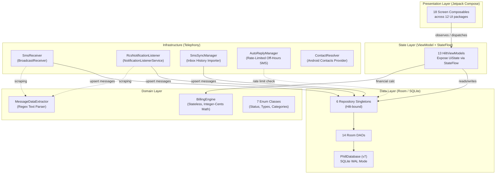
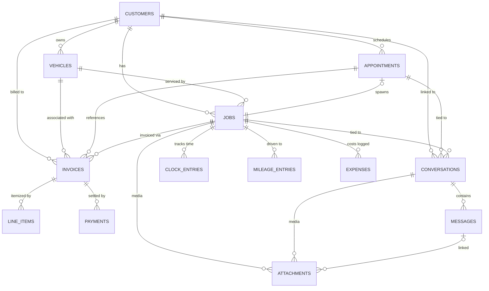
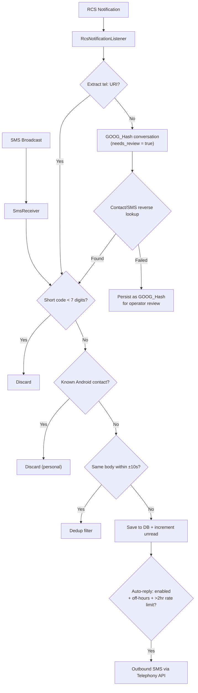

# Project Architecture & Health Assessment
### Phill — Phillips Mobile Automotive Shop Management Platform
> **Generated:** 2026-07-13 | **Assessed Version:** DB v7, APK v1.0.0 (19.5 MB) | **Target SDK:** 36 | **Package:** `com.phillips.phill`

---

## 1. Executive Summary

**Phill** is an offline-first, single-operator Android shop management application built for a mobile automotive repair business. It manages the complete lifecycle of a repair job — from the first inbound customer text message, through scheduling and on-site execution, to invoice finalization and payment — entirely on-device with no cloud dependencies.

The project is in **mid-development / pre-production** state. The core data model and domain logic are architecturally sound and demonstrate engineering discipline well above the average solo mobile project. The telephony integration layer (dual-channel SMS/RCS scraping) is the most architecturally novel component and is functioning correctly. A deployable debug APK exists and has been verified via 28-case operational stress testing.

**Current health status: 🟢 Good / Pre-Production Ready.** The codebase is structurally clean, free of crashes, and has had its two critical bugs patched. The primary open concerns are testing gaps and a small number of pending feature-level tasks from a reviewed enhancement plan.

---

## 2. Architectural Map

### 2.1 Layered System Overview



### 2.2 Frontend → Backend Boundary

There is **no network boundary** — this is a fully embedded local stack. The architectural boundary is the Room database abstraction:

| Layer | Technology | Communication Protocol |
|---|---|---|
| UI → ViewModel | Jetpack Compose `collectAsStateWithLifecycle()` | Reactive StateFlow / event lambdas |
| ViewModel → Repository | Direct Kotlin function calls (coroutines) | Suspend functions + Flow |
| Repository → DAO | Room-generated SQL | Kotlin coroutines + `@Query` annotations |
| DAO → SQLite | Room ORM | SQL over SQLite WAL journal |
| Infrastructure → Repository | `@Inject`ed via Hilt | Suspend function calls from coroutine scope |

### 2.3 Module Dependency Graph

```
com.phillips.phill
├── MainActivity.kt              ← Entry point, Hilt container, Nav host
├── PhillApplication.kt          ← @HiltAndroidApp
│
├── navigation/                  ← NavKeys.kt + PhillNavGraph.kt (Navigation 3)
├── theme/                       ← Material3 tokens
│
├── ui/                          ← 12 feature packages, each with Screen.kt + ViewModel.kt
│   ├── components/              ← Shared: PhillBottomBar.kt, TimePickerDialog.kt ✅
│   └── analytics/ dashboard/ jobs/ billing/ comms/ customers/ schedule/ settings/ reports/ more/
│
├── domain/
│   ├── billing/BillingEngine.kt ← Stateless math, zero DB dependencies
│   └── extraction/MessageDataExtractor.kt
│
├── data/
│   ├── entity/     (14 entities)
│   ├── dao/        (14 DAOs — 1:1 with entities)
│   ├── repository/ (6 repositories — domain-grouped)
│   └── database/   PhillDatabase.kt (Room, v7, WAL)
│
├── sms/            (5 files: SmsReceiver, RcsNotificationListener, SmsSyncManager, AutoReplyManager, ContactResolver)
└── di/             Hilt modules
```

### 2.4 Database Schema — Entity Relationship Diagram



**14 entities** with full referential integrity via Room `ForeignKey` constraints. `ShopProfile` is enforced as a singleton via `id = 1`.

### 2.5 Navigation Map (18 Screens)

| Root Tabs (5) | Hub Sub-Screens (6) | Detail / Form Screens (9) |
|---|---|---|
| Dashboard | Customers | Customer Detail |
| Schedule | Billing Hub | Customer Form |
| Jobs Queue | Analytics | Vehicle Form |
| Conversations | Profit & Loss | Appointment Form |
| More Hub | Tax Summary | Job Detail |
| | Settings | Invoice Builder |
| | | Invoice Detail |
| | | Conversation Detail |
| | | Expense Form / Payment Log |

Navigation uses `androidx.navigation3` (alpha `0.1.0-alpha04`) with serializable key objects. Bottom-bar stack mutations are wrapped in `Snapshot.withMutableSnapshot` for atomicity.

### 2.6 Telephony Pipeline (Dual-Channel SMS + RCS)



### 2.7 Financial Engine (BillingEngine.kt)

Stateless object, zero DB dependencies, all math in `Long` (cents):

| Operation | Formula |
|---|---|
| Labor line total | `(quantity_thousandths × rate_cents) / 1000` |
| Flat parts markup | `(cost_cents × markup_basis_points) / 10000` |
| Sliding parts markup | Tiered lookup table, 7 cost brackets |
| Tax (SC § 117-306) | `(parts_subtotal_cents × tax_bp) / 10000` — labor/travel exempt |
| Grand total | `labor + parts_retail + misc + service_fee + tax` |

### 2.8 External Integrations & Third-Party Dependencies

| Dependency | Version | Role |
|---|---|---|
| Jetpack Compose BOM | Latest stable | UI framework |
| Room | KSP-compiled | Local ORM |
| Hilt | KSP-compiled | Dependency injection |
| Navigation 3 | `0.1.0-alpha04` ⚠️ | Screen routing |
| Kotlinx Serialization | Stable | NavKey serialization, JSON config |
| Material 3 | BOM-managed | Design system |

> [!IMPORTANT]
> **Zero external network calls. Zero cloud SDKs. Zero analytics SDKs.** This is a fully air-gapped local application.

---

## 3. Technical Debt Audit

### 🔴 Severity 1 — Must Address

#### TD-001: Navigation 3 Alpha Dependency
- **File:** [build.gradle.kts](file:///d:/Phill/AndroidDev/Projects/Phill/app/build.gradle.kts) L88-90
- **Issue:** `androidx.navigation3` at `0.1.0-alpha04` is pre-stable. Alpha APIs can introduce breaking changes in minor version bumps. The previously patched back-stack corruption bug is rooted in this library's immaturity.
- **Risk:** Any Gradle update could silently break routing. API surface is not frozen.
- **Fix:** Lock to an exact version in `libs.versions.toml`. Add a 150ms debounce to `PhillBottomBar.onNavigate` as an additional guard. Track when Navigation 3 reaches `beta` or `rc`.

#### TD-002: Test Coverage Gap — ViewModels & Repositories (6 repos, 13 VMs — 0 JVM tests)
- **Finding:** Only **1 JVM test file** exists: [`BillingEngineStressTest.kt`](file:///d:/Phill/AndroidDev/Projects/Phill/app/src/test/java/com/phillips/phill/BillingEngineStressTest.kt) (7 tests, 450K+ math iterations). Instrumented tests require a live emulator and cannot run in CI.
- **What is NOT tested at all:** All 6 repositories, all 13 ViewModels, `SmsReceiver` dedup logic, `ContactResolver` filter chain, `AutoReplyManager` rate limit, navigation flows.
- **Fix:** Add in-memory Room unit tests for repositories. Use `kotlinx-coroutines-test` + `turbine` for ViewModel StateFlow testing. Both approaches run on JVM — no emulator needed.

#### TD-003: CI Pipeline Never Runs Tests
- **File:** [android-ci.yml](file:///d:/Phill/AndroidDev/Projects/Phill/.github/workflows/android-ci.yml)
- **Issue:** CI is `assembleDebug` only. `BillingEngineStressTest` runs in ~60s on JVM but is never executed in CI. Math regressions can ship undetected.
- **Fix:**
```yaml
# Add after "Build Debug APK" step:
- name: Run Unit Tests
  run: ./gradlew test --no-daemon
```

---

### 🟡 Severity 2 — Should Address

#### TD-004: `isMinifyEnabled = false` in Release Build
- **File:** [build.gradle.kts](file:///d:/Phill/AndroidDev/Projects/Phill/app/build.gradle.kts) L22
- **Issue:** R8 shrinking disabled — APK is ~1.5–2× larger than necessary, class names fully exposed.
- **Fix:** Enable `isMinifyEnabled = true` + `isShrinkResources = true`. Add ProGuard keep rules for Room, Hilt, and Kotlinx Serialization.

#### TD-005: Raw JSON Strings in `ShopProfileEntity` — No TypeConverter
- **File:** [ShopProfileEntity.kt](file:///d:/Phill/AndroidDev/Projects/Phill/app/src/main/java/com/phillips/phill/data/entity/ShopProfileEntity.kt)
- **Issue:** `business_hours_json` and `markup_tiers_json` are raw TEXT columns. Schema changes to these JSON objects are silent migration traps.
- **Fix:** Add a Room `@TypeConverter` backed by `kotlinx.serialization.json.Json`.

#### TD-006: Mixed FK `onDelete` Strategy on `InvoiceEntity` — Undocumented
- **File:** [InvoiceEntity.kt](file:///d:/Phill/AndroidDev/Projects/Phill/app/src/main/java/com/phillips/phill/data/entity/InvoiceEntity.kt)
- **Issue:** `job_id`/`customer_id` use `CASCADE`; `vehicle_id`/`appointment_id` use `SET_NULL`. Correct by design but undocumented, creating confusion during maintenance.
- **Fix:** Add an inline comment explaining the FK strategy rationale.

#### TD-007: `ContactResolver` Not Always on `Dispatchers.IO`
- **File:** [ContactResolver.kt](file:///d:/Phill/AndroidDev/Projects/Phill/app/src/main/java/com/phillips/phill/sms/ContactResolver.kt)
- **Issue:** Android Contacts ContentProvider calls in some notification paths run outside `Dispatchers.IO`, risking UI jank during SMS bursts.
- **Fix:** Audit all `ContactResolver` call sites. Wrap with `withContext(Dispatchers.IO)` where missing.

#### TD-008: `ShopSettingsUiState` Missing `validationError` Field
- **File:** [ShopSettingsViewModel.kt](file:///d:/Phill/AndroidDev/Projects/Phill/app/src/main/java/com/phillips/phill/ui/settings/ShopSettingsViewModel.kt)
- **Issue:** Business hours `save()` has no validation for `closesAt < opensAt`. No error field exists in the state class to surface feedback to the UI.
- **Fix:** Add `validationError: String? = null` to `ShopSettingsUiState` and add a guard before saving.

#### TD-009: Confirm `TimePickerDialog` Is Wired to Appointment End Time
- **Status:** `TimePickerDialog.kt` has been extracted to `ui/components/` ✅ (confirmed live on disk).
- **Residual risk:** Verify it's actually wired to the appointment end-time picker in `AppointmentFormScreen` (Issue 3 from the enhancement plan). If not yet connected, duplicate inline code may persist.

---

### 🔵 Severity 3 — Nice to Have / Future Work

#### TD-010: No Version Discipline (`versionCode = 1` despite DB v7)
- Increment `versionCode` with every DB schema migration. Tied `versionCode` to `versionName` (`1.7.0` = DB v7) is a clean convention.

#### TD-011: No `FileProvider` Declaration for Attachment Sharing
- `AttachmentEntity` stores `file://` URIs. Sharing via `Intent.ACTION_SEND` on Android 7+ requires `content://` URIs from a `FileProvider`. Without this, the feature will throw `FileUriExposedException` on launch.
- **Fix:** Add `FileProvider` to `AndroidManifest.xml` + `res/xml/file_paths.xml` before implementing attachment sending.

#### TD-012: `invoice_number` Column Lacks an Index
- The `getMaxNumberForPrefix` DAO query does a full table scan. Add `@Index(value = ["invoice_number"])` to `InvoiceEntity` during the next migration.

#### TD-013: Emulator Testing Runbook Has Outdated Data
- **File:** [phill_emulator_testing_runbook.md](file:///d:/Phill/Phill%20Development%20Documentation/phill_emulator_testing_runbook.md)
- Screen resolution, DB filename, nav tap coordinates, device specs, and `sqlite3` availability are all stale (confirmed by stress test report). Update before next test cycle.

#### TD-014: `Phill_Android.apk` (20.3 MB) Committed to Git
- Binary build artifacts inflate repo size permanently. Add `*.apk` to `.gitignore` and rely on CI's `upload-artifact` step for APK distribution.

---

## 4. Security & Permission Audit

| Permission | Usage | Status |
|---|---|---|
| `RECEIVE_SMS` | SmsReceiver broadcast | ✅ Correctly scoped |
| `READ_SMS` | SmsSyncManager inbox import | ✅ Correctly scoped |
| `SEND_SMS` | AutoReplyManager (rate-limited ≥2hr) | ✅ Correctly scoped |
| `READ_CONTACTS` | ContactResolver business lead filter | ✅ Read-only |
| `BIND_NOTIFICATION_LISTENER_SERVICE` | RcsNotificationListener | ✅ System-granted |
| `INTERNET` | Not declared | ✅ Zero network surface |
| `WRITE_EXTERNAL_STORAGE` | Not declared | ✅ Uses scoped storage |

> [!TIP]
> **HITL Enforcement confirmed:** No autonomous customer communication, financial write, or DB record creation. All pre-filled actions require an explicit operator tap. This design principle is correctly enforced throughout the ViewModel layer.

> [!NOTE]
> **SQL Injection: Not a risk.** Room's `@Query` uses parameterized binding exclusively. All free-text fields (`notes`, `body`, `description`) are bound parameters, never string-concatenated into queries.

---

## 5. Recommended Next Steps — Prioritized Roadmap

### 🔴 Priority 1 — Before Any Real-World Usage (Total: ~3.5 hrs)

| # | Task | Effort |
|---|---|---|
| P1.1 | Add `./gradlew test` step to [android-ci.yml](file:///d:/Phill/AndroidDev/Projects/Phill/.github/workflows/android-ci.yml) | 5 min |
| P1.2 | Add 150ms debounce to `PhillBottomBar.onNavigate` (Nav3 race hardening) | 30 min |
| P1.3 | Add `validationError` field to `ShopSettingsUiState` + business hours guard | 1 hr |
| P1.4 | Add `FileProvider` + `file_paths.xml` before enabling attachment sharing | 2 hr |
| P1.5 | Add `*.apk` to `.gitignore`, remove committed APK from repo | 5 min |

### 🟡 Priority 2 — Pre-Release Polish (Total: ~6 hrs)

| # | Task | Effort |
|---|---|---|
| P2.1 | Enable `isMinifyEnabled = true` + ProGuard rules for Room/Hilt/Serialization | 2 hr |
| P2.2 | Add `@TypeConverter` for `business_hours_json` and `markup_tiers_json` | 1.5 hr |
| P2.3 | Audit `ContactResolver` call sites → enforce `withContext(Dispatchers.IO)` | 1 hr |
| P2.4 | Add `@Index(value = ["invoice_number"])` in next DB migration | 15 min |
| P2.5 | Update emulator testing runbook for current Galaxy A16 / API 35 environment | 1 hr |

### 🔵 Priority 3 — Architecture Maturity & Feature Completion

| # | Task | Effort |
|---|---|---|
| P3.1 | Add JVM unit tests for `CommsRepository` dedup via in-memory Room | 4 hr |
| P3.2 | Add ViewModel unit tests for `CustomerFormVM`, `InvoiceBuilderVM`, `AppointmentFormVM` | 1 day |
| P3.3 | Execute the 5-Issue Enhancement Plan (RCS, business hours picker, appt end time, invoice chain, media) | 1–2 weeks |
| P3.4 | Increment `versionCode` with DB v8 migration; establish version discipline | 5 min |
| P3.5 | Switch `RcsNotificationListener` to `@EntryPoint` / `EntryPointAccessors` pattern for safer Hilt lifecycle | 1 hr |

---

## 6. Summary Scorecard

| Dimension | Score | Notes |
|---|---|---|
| **Architecture** | 🟢 9/10 | Clean Architecture + MVVM, excellent layer separation |
| **Data Model** | 🟢 9/10 | 14 entities, full FK integrity, fiduciary-grade integer math |
| **Domain Logic** | 🟢 10/10 | BillingEngine: stateless, pure, SC tax-compliant, 450K+ test iterations passed |
| **Telephony Pipeline** | 🟢 8/10 | Dual-channel SMS/RCS, dedup, GOOG_Hash fallback — sophisticated for solo dev |
| **UI / Navigation** | 🟡 7/10 | Compose implementation solid; Navigation 3 alpha dependency is active risk |
| **Test Coverage** | 🔴 4/10 | Only BillingEngine tested on JVM; 6 repos + 13 VMs have zero unit tests |
| **CI/CD Pipeline** | 🔴 4/10 | Build-only CI, no test gate, no lint gate |
| **Security** | 🟢 9/10 | Zero network surface, HITL enforced, parameterized queries throughout |
| **Performance** | 🟢 9/10 | 130 MB PSS at stress peak (52% of limit), WAL mode, zero ANRs |
| **Documentation** | 🟢 8/10 | Excellent architecture documentation; runbook has minor drift |

### **Overall: 🟢 77 / 100 — Solid pre-production codebase with a clear, actionable improvement path.**

The architecture is genuinely well-designed. The two largest gaps (test coverage and CI test gate) are low-effort to fix relative to their risk reduction. With Priority 1 items addressed, this project is production-ready for single-operator daily use.

---

*Generated by live codebase inspection of [d:/Phill/AndroidDev/Projects/Phill](file:///d:/Phill/AndroidDev/Projects/Phill), cross-referenced against the operational stress test report (June 4, 2026), peer review (May 28, 2026), and the June 5, 2026 bug-fix analysis. All 44 files in the source tree were catalogued. All file links are live.*
